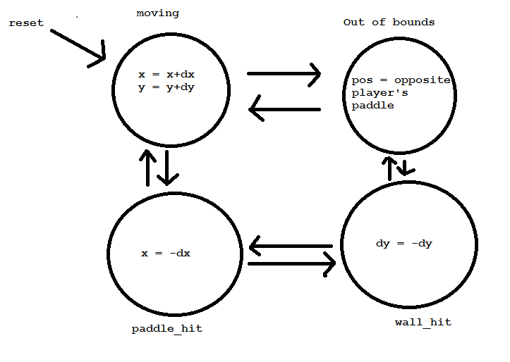
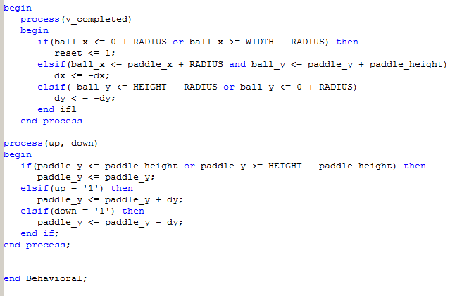
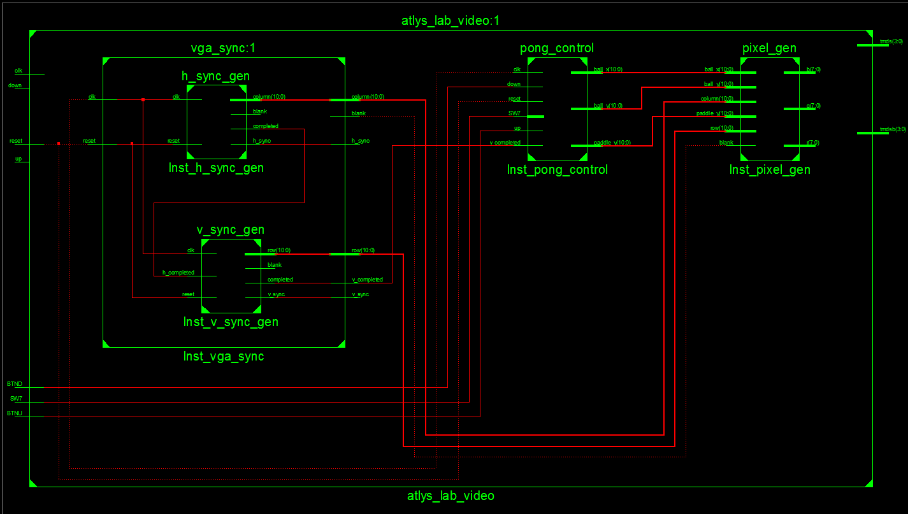
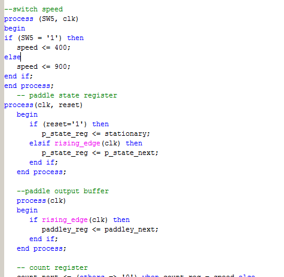

383 Lab 2 - Pong
==================

Prelab
=====

1. State diagram
=========
____________

Bounds Checking
=========
_________
2. The bounds checking will be done using if/else statements checking to see if the x and y postions are on any of the
boundaries or near the paddle. If the ball hits the paddle or the right wall the x direction will be inverted. If the ball
hits the top or bottom the y direction will be inverted. The ball will be updated via ball_x = ball_x/y + dx/dy  where dx/dy
equals a constant change in pixels predetrmined at the beginning.

3. Register/Combinational equations
===========
___________

Implementation
==============

I included my button logic inside of my pong control rather than creating a separate file. Although it was easier for me to understand conceptually it may have been a part of the troubles I had. I created separte moore machines for the ball and paddle using a state register, and output buffer, next-state logic, and look ahead output logic. I used a single count register for the ball and paddle speed and though I created a working register for the B functionality, the ball code didn't work properly when the switch was implemented.

Test/Debug
===============

The hardest part about this lab for me was getting the paddle to move. I cleaned up my code by removing unnecessary signals from the sensitivity lists and adding necessary ones. This helped when compiling but the paddle still would not move. I troubleshot with trial and error and it wasn't until I changed my integers to unsigned that I was finally able to get my paddles working.

Documentation: C2C Schriner helped me with this prelab
